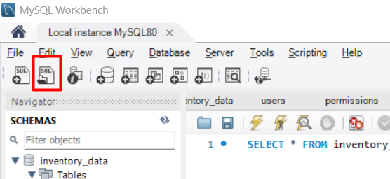

Prueba tecnica para ingreso a castores

ID utilizado:
    Backend: IntelliJ IDEA Community Manager V2024.3.5
    Frontend: Visual Stucio Code
Versión de lenguaje utilizado:
    Java 17 - OpenJDK Zulu1754+21-CA
DBMS utlizado:
    MySql Workbench v8.0.36

Siga estos pasos para correr la aplicación

Creando base de datos:

Abra su administrador de base de datos  
En la barra de opciones de clic "Open a SQL script file in a new Query tab" 
    
En la carpeta scripts ubicada en la raiz del proyecto encontrará el script "inventory_data.sql"
Abralo y ejecute el script

Ejecutando proyecto backend:
    
    Instale la versión de java necesaria para este proyecto y habilite su uso configurando las variables de entorno. Puede encontrar el ejecutable en el siguiente enlace:
        https://www.azul.com/downloads/?version=java-17-lts&package=jdk&show-old-builds=true#zulu 
    
    Para compilar el proyecto puede utilizar las herramientas de maven que le provea su editor de código. Sin embargo es recomendable utlizar directamente maven. Si no lo tiene instalado puede obtenerlo del siguiente enlace. Descargue la distribucion Binary zip:
        https://maven.apache.org/download.cgi
    
    En el siguiente video encontrará una forma facil de instalarlo y configurarlo:
        https://www.youtube.com/watch?v=rl5-yyrmp-0
    
    En su editor de código, abra una termiinal y ejecute el siguiente comando para compilar el proyecto: 

        mvn clean install

    Abra la clase principal (TestApplication.java) y ejecutela usando su editor de código. Es recomendable utilizar el editor IntelliJ IDEA ya que le provee las herramientas necesarias para la ejecución de la app
    

Ejecutando proyecto frontend
    
    El proyecto de Front esta construido con Angular 19. Para poder ejecutarlo es necesario tener instalados:
        Node Version Manager:
         https://github.com/coreybutler/nvm-windows aqui podra encontrar el instalador y las instrucciones para instalar NVM
        Abra una terminal para instalar: 
            Node.js
                Ejecute el siguiente comando:
                    nvm install 22.14.0
            Angular
                Ejecute el siguiente comando: 
                    npm install -g @angular/cli
    Ya que se tengan las herramientas de ejecución instaladas por medio de la terminal dirijase a la carpeta Frontend
    Ejecute los siguientes comandos:
        npm install : Este comando descargará todas las dependencias del proyecto
        ng serve : Este comando iniciará la aplicación de angular en la url http://localhost:4200

Por defecto en la ejecución del script de base de datos se han creado dos usuarios:
    Administrador:
        email: a.salazar@castores.com
        password: contraseña
    Almacenista:
        email: a.corona@castores.com
        password: contraseña
Estos perfiles corresponden a los descritos en la información de la prueba técnica
        
